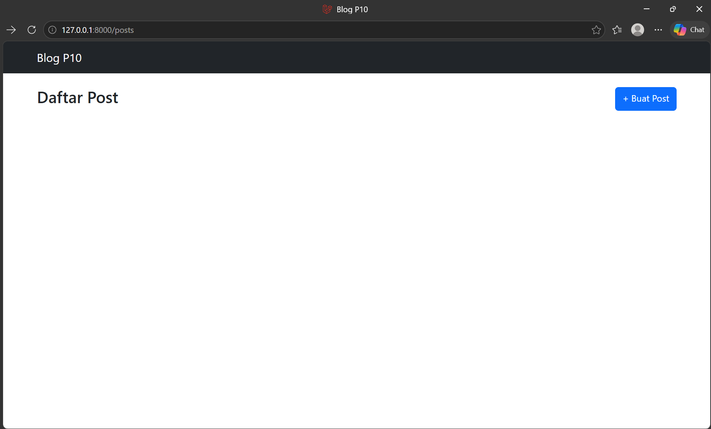
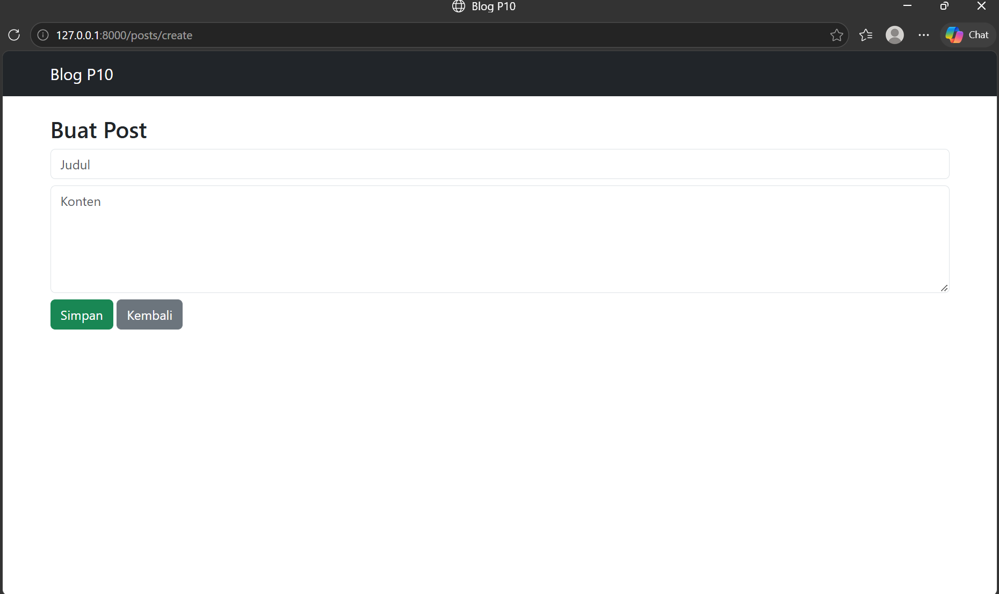

# Tugas Rutin 10 - Blog CRUD Laravel

Repository: TugasWeb-P10-BlogCRUD

## Identitas

Nama: Nazla Muthia
NIM: 4253250052
Kelas: PSIK 25A
Matkul: Pemrograman Web

## Requirements P10

1. Route::resource('posts') + named routes
2. PostController resource (7 methods: index, create, store, show, edit, update, destroy)
3. Blade layout master + @extends dan @yield
4. Minimal 2 components (Alert, Card)
5. Validasi + error per field + old input
6. Flash message sukses/gagal
7. @csrf semua form + @method PUT/DELETE
8. Route Model Binding + pagination

Bonus: pencarian, soft delete, upload gambar

## Cara Menjalankan

1. git clone https://github.com/nazlamuthia/TugasWeb-P10-BlogCRUD.git
2. composer install
3. cp .env.example .env
4. php artisan key:generate
5. Buat database blog_p10 di phpMyAdmin
6. Setting DB_DATABASE=blog_p10 di .env
7. php artisan migrate
8. php artisan serve
9. Buka http://127.0.0.1:8000/posts

## Screenshot Hasil

Halaman Daftar Post:

Halaman Buat Post:

